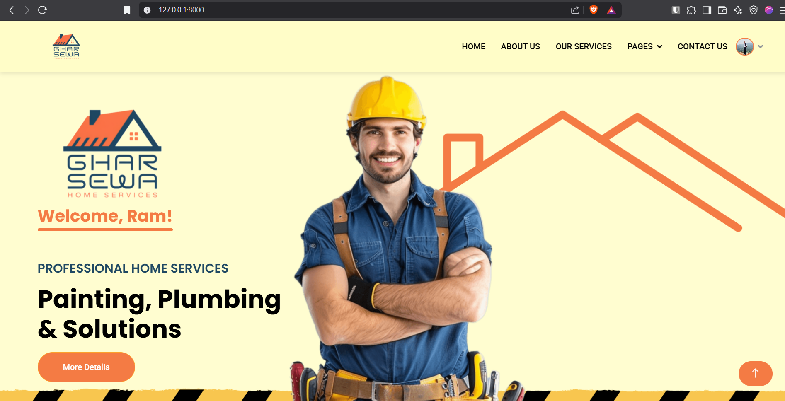
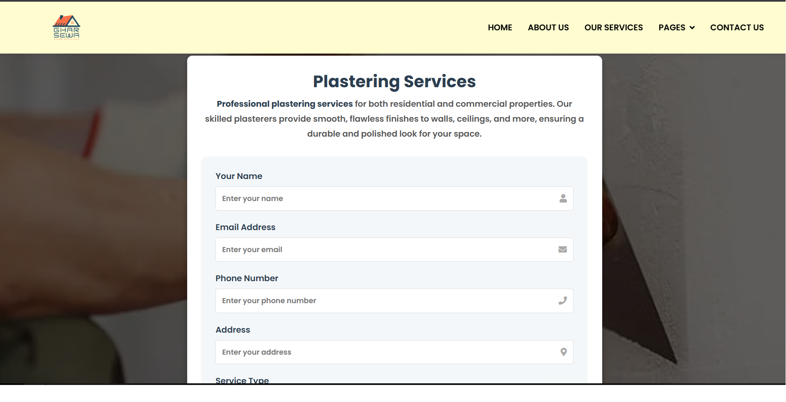
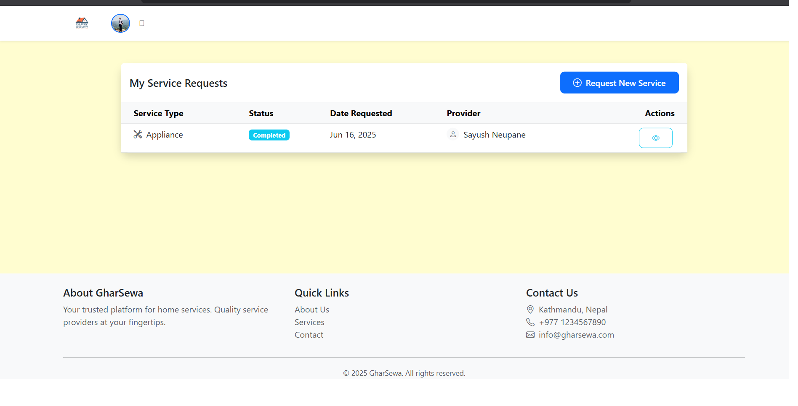
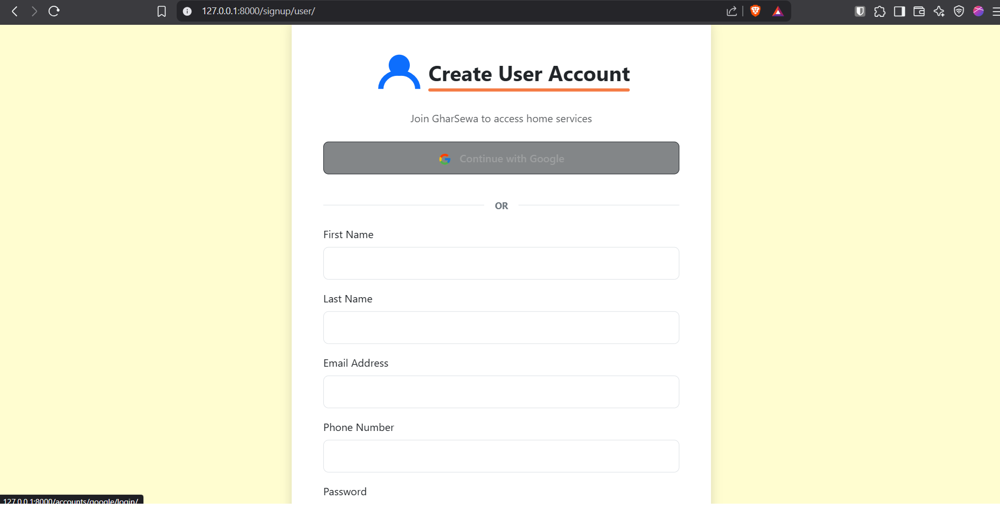
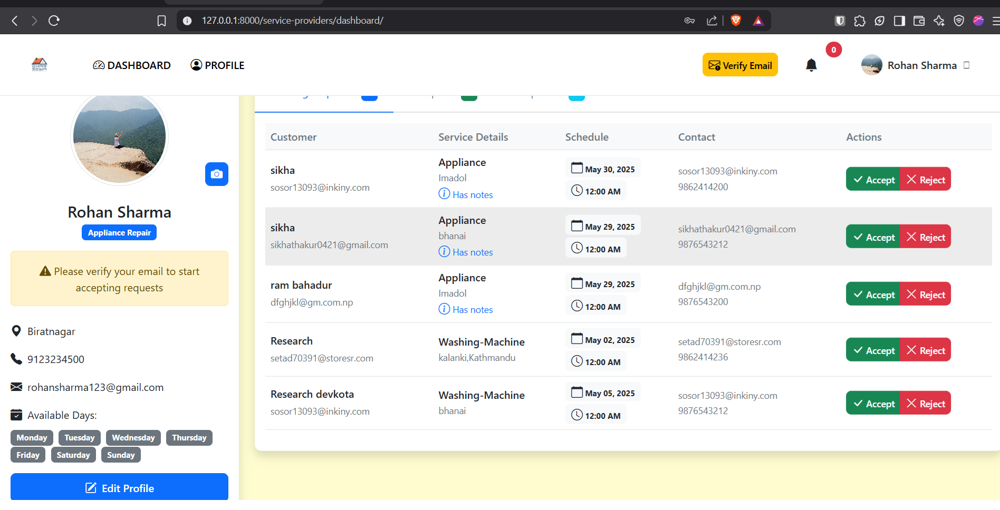

# GharSewaProject

GharSewaProject is a Django-based web platform for booking and managing home services such as painting, plumbing, electrical work, cleaning, appliance repair, and more. It connects users with verified service providers, streamlining the process of finding, booking, and reviewing home services.


NOTE: 
This is a partial version of the GharSewa project. The complete and fully functional project is hosted in a separate private repository. For access or collaboration inquiries, please contact me directly. Unauthorized copying, reproduction, or distribution of this project is strictly prohibited and may lead to legal consequences.

The screenshots of the system is as below:

## Features

- **User Registration & Authentication**: Secure sign-up and login with email (custom user model), profile management, and password reset.
- **Service Provider Management**: Providers can register, manage their profiles, and specify their service types and availability. Admins can verify providers.
- **Service Booking & Requests**: Users can browse services, book appointments, and track the status of their requests. Providers receive notifications for new requests and status updates.
- **Dashboard**: Separate dashboards for users, providers, and admins to manage bookings, services, and profiles.
- **Notifications**: Real-time notifications for service requests and status changes.
- **Testimonials & Ratings**: Users can leave testimonials and rate service providers.
- **Responsive Frontend**: Modern, mobile-friendly UI using Bootstrap and custom templates.
- **Admin Panel**: Full-featured Django admin for managing users, providers, services, and bookings.

## Technology Stack

- **Backend**: Python, Django, Django REST Framework, Channels (for real-time features)
- **Frontend**: HTML, CSS (Bootstrap), JavaScript, Django Templates
- **Database**: SQLite (default, can be switched to PostgreSQL/MySQL)
- **Other Libraries**: django-allauth, django-crispy-forms, channels-redis, Pillow, etc.

## Directory Structure

```
homeservices/
├── allservices/         # Service categories, booking logic
├── dashboard/           # User and provider dashboards
├── service_providers/   # Provider management
├── services/            # Service logic
├── users/               # Custom user model and authentication
├── templates/           # HTML templates
├── static/              # Static files (CSS, JS, images)
├── media/               # Uploaded media (profile photos, etc.)
├── manage.py            # Django management script
└── db.sqlite3           # Default database
```

## Getting Started

### Prerequisites
- Python 3.8+
- pip (Python package manager)

### Installation
1. **Clone the repository:**
   ```bash
   git clone <repository-url>
   cd GharSewaProject/homeservices
   ```
2. **Create a virtual environment:**
   ```bash
   python -m venv venv
   source venv/bin/activate  # On Windows: venv\Scripts\activate
   ```
3. **Install dependencies:**
   ```bash
   pip install -r ../requirements.txt
   ```
4. **Apply migrations:**
   ```bash
   python manage.py migrate
   ```
5. **Create a superuser (admin):**
   ```bash
   python manage.py createsuperuser
   ```
6. **Run the development server:**
   ```bash
   python manage.py runserver
   ```
7. **Access the app:**
   - Visit [http://127.0.0.1:8000/](http://127.0.0.1:8000/) in your browser.

## Usage
- **Users:** Register, browse services, book appointments, and manage requests.
- **Service Providers:** Register, set up your profile, manage availability, and respond to service requests.
- **Admin:** Manage users, providers, services, and bookings via the admin dashboard (`/admin/dashboard`).

## Contributing
Pull requests are welcome! For major changes, please open an issue first to discuss what you would like to change.

## Acknowledgements
- Django, Django REST Framework, Bootstrap, and all open-source contributors.

Screenshots of the system:

### 1. Home Page (User Dashboard)


### 2. Plastering Service Booking Form


### 3. My Service Requests (User View)


### 4. User Registration / Signup Page


### 5. Service Provider Dashboard

